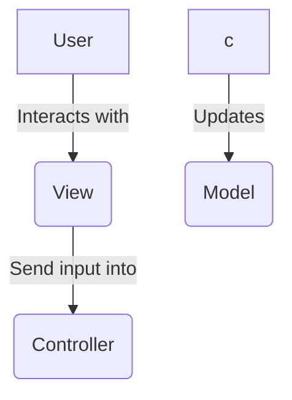

```bash
dotnet --version
dotnet new list
dotnet new mvc -n mvc -o [nom]
```

```bash
dotnet run //compilation, génération des executables, lancement de l'app
dotnet build
```

fichier .sln ne pas toucher ou supprimer
fichier .csproj = carte d identite du projet, similaire au xml
Program.cs = fichier d'entrer



Model => Encapsule les données
view => pages web
controller => logique du code / interaction avec les view

espace de nom => pour simplifier les imports/exports ( contenant virtuel )
-> nommage = [ProjName].[FolderName]
'using' => permet d importer

dans une classe : field != properties
fiel = priver
properties = avec getter et setter

les methodes de controllers = ACTIONS !
