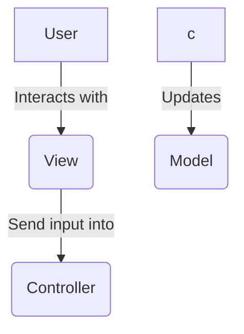

```bash
dotnet --version
dotnet new list
dotnet new mvc -n mvc -o [nom]
```

```bash
dotnet run //compilation, génération des executables, lancement de l'app
dotnet build
```

fichier .sln ne pas toucher ou supprimer
fichier .csproj = carte d identite du projet, similaire au xml
Program.cs = fichier d'entrer



Model => Encapsule les données
view => pages web
controller => logique du code / interaction avec les view

espace de nom => pour simplifier les imports/exports ( contenant virtuel )
-> nommage = [ProjName].[FolderName]
'using' => permet d importer

dans une classe : field != properties
fiel = priver
properties = avec getter et setter

les methodes de controllers = ACTIONS !

importation de model dans les vues => @model Class

Interface => squelette de classe pour factorisation, implementation obligatoire des fonctions, multiplicité

Utilisation des annotations

[HttpPost] => pour definir les routes avec les bonnes methodes

[Required] => Definir un champs comme requis
[Display] => Changer le nom du label
[StringLength] => definir la taille d un string
[EmailAdress] => pattern pour un email

balise html with razor

<form asp-action="Action" asp-controller="Controller" method="method"> (pour submit un formulaire sur un action dans un certain controlleur avec une certaine methode http)
<label asp-for="Propertie"> => pour ecrire le nom de la propertie ( ou le display )
<input asp-for="Propertie"> => pour set une value a une propertie
 <span asp-validation-for="Propertie"> => Pour les messages d'erreur

# BDD

DBContext

```c#
builder.Services.AddDbContext<[ClasseDbContext]>(
    options => options.UseSqlServer("chaine de connexion")
)
```

création de la classe

```c#
using Microsoft.EntityFrameworkCore;

namespace mvc.Data;

//Cette classe permet de définir les tables de la BDD
public class ApplicationDbContext : DBContext {

    public ApplicationDbContext(DbContextOptions<ApplicatitonDbContext> options) : base(options){

    }

    // Créaton d'un dbset pour chaque table utilisé
    // DbSet est une classe qui represente une table de la BDD
    // Permet le mapping
    public DbSet<Teacher> Teachers {get; set;}
    public DbSet<Student> Students {get; set;}
}
```

dotnet tool install --global dotnet-ef
dotnet ef migrations add [MigrationName]
dotnet ef database update

## EntityFramework DbContext

dans le controller

```c#
private readonly ApplicationDbContext _context;
```
